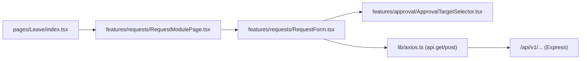
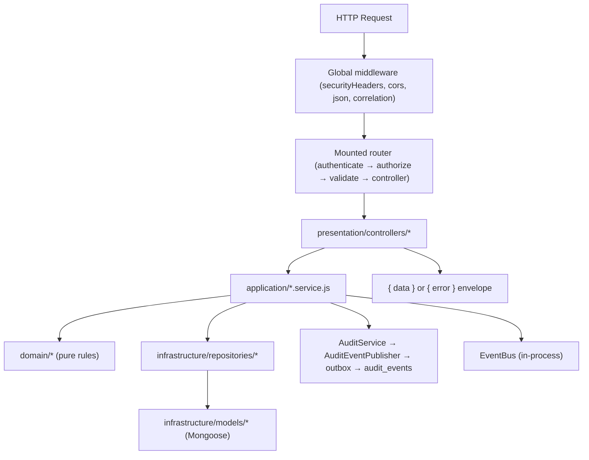
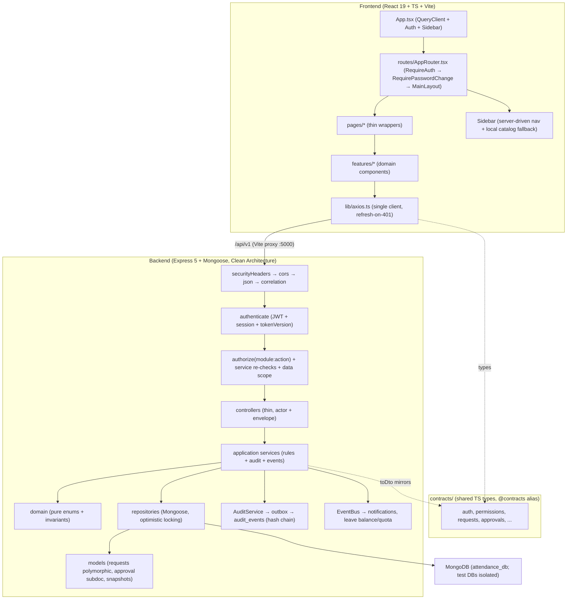

# Project Context

> Generated by Senior Software Architect Codebase Analysis
>
> This document is the **single source of truth about the current implementation** of the HRIS SaaS Platform repository. Every claim below was verified against actual source code in the repository. Future AI agents (DESIGNER.md, DEVELOPER.md, and others) MUST read this document before making any change.
>
> Repository root: `C:\Attendance System`

---

## 1. Executive Summary

This repository contains a production-grade **enterprise HRIS (Human Resource Information System) SaaS web application** — a single shared web application where all users (Employee, Manager, HR Administrator, Super Administrator) log in through one frontend and are differentiated purely by Role-Based Access Control (RBAC).

The system is organized as **three top-level areas**:

| Area | Location | Purpose |
|---|---|---|
| Frontend | `frontend/` | React 19 + TypeScript + Vite SPA |
| Backend | `backend/` | Node.js / Express 5 REST API (CommonJS) |
| Shared contracts | `contracts/` | TypeScript-only type definitions shared between frontend and backend (frontend imports via `@contracts` alias) |

Key architectural facts:

- **Clean Architecture** on the backend: `presentation` (controllers/routes/DTOs) → `application` (services) → `domain` (pure business rules) → `infrastructure` (Mongoose models, repositories, middleware, seed). Wired manually via constructor dependency injection in the composition root `backend/server.js`.
- **Single polymorphic request store**: all request types (Leave, Overtime, Business Trip, Permission, Sickness) are stored in one `requests` collection discriminated by `type`, with an embedded `approval` subdocument.
- **The approval workflow revamp (FR-001/002/003/063) is fully implemented**: configurable role-level approval configuration, role-vs-user approval targets, atomic claiming, mandatory rejection reasons, configuration snapshots, approval history, and audit events.
- **Tamper-evident audit logging** via a SHA-256 hash chain with an outbox-based capture pipeline.
- **Comprehensive test suite**: ~90 backend test files (unit + integration) using the built-in `node:test` runner, in-memory repository fakes, and `supertest` integration tests against isolated test MongoDBs.
- The feature backlog (`BACKLOG.md`) defines **FR-001 through FR-064**; the majority are implemented (marked `[x]`).

---

## 2. Technology Stack

### Frontend

| Concern | Technology | Evidence |
|---|---|---|
| Framework | React 19 (`react`, `react-dom` ^19.2.8) | `frontend/package.json:23-24` |
| Language | TypeScript ~6.0.2 (strict bundler mode) | `frontend/package.json:45`, `frontend/tsconfig.app.json` |
| Build tool | Vite 8 (`@vitejs/plugin-react` 6) | `frontend/package.json:47`, `frontend/vite.config.ts` |
| CSS | Tailwind CSS v4 (via `@tailwindcss/vite` plugin, CSS-first config) | `frontend/package.json:15,29`, `frontend/src/index.css` |
| Routing | `react-router-dom` v7 | `frontend/package.json:26`, `frontend/src/routes/AppRouter.tsx` |
| Data fetching | `@tanstack/react-query` v5 | `frontend/package.json:16`, `frontend/src/App.tsx:8-16` |
| Forms | `react-hook-form` v7 + `zod` v4 + `@hookform/resolvers` | `frontend/package.json:14,30` (RHF used only on Login; most feature forms use controlled `useState`) |
| HTTP client | `axios` | `frontend/package.json:17`, `frontend/src/lib/axios.ts` |
| UI primitives | Hand-rolled components (`Button`, `Input`, `Modal`, `Spinner`, `toast`) using `class-variance-authority`, `clsx`, `tailwind-merge` | `frontend/src/components/ui/*`, `frontend/package.json:18-20` |
| Icons | `lucide-react` | `frontend/package.json:22`, `frontend/src/constants/sidebar.ts:1-23` |
| Dates | `dayjs` | `frontend/package.json:21` |
| Alerts | `sweetalert2` (dependency present) | `frontend/package.json:27` |
| Maps | `leaflet` + `@types/leaflet` (used for attendance location verification) | `frontend/package.json:22,34`, `frontend/src/features/attendance/LocationVerification.tsx` |
| Path aliases | `@` → `src`, `@contracts` → `../contracts` | `frontend/vite.config.ts:14-19` |

### Backend

| Concern | Technology | Evidence |
|---|---|---|
| Framework | Express 5.2 | `backend/package.json:22` |
| Language | JavaScript (CommonJS, `"type": "commonjs"`) | `backend/package.json:17` |
| ODM | Mongoose 9.9 | `backend/package.json:24` |
| Validation | Zod 4 (`zod`) | `backend/package.json:27`, `backend/src/presentation/dto/*.dto.js` |
| Auth tokens | `jsonwebtoken` 9 | `backend/package.json:23` |
| Password hashing | `bcryptjs` 3 | `backend/package.json:19` |
| File uploads | `multer` 2 | `backend/package.json:26` |
| CORS | `cors` | `backend/package.json:20` |
| Env | `dotenv` | `backend/package.json:21` |
| Testing | Built-in `node:test` runner + `supertest` | `backend/package.json:9-11,30` |

### Database

| Concern | Technology | Evidence |
|---|---|---|
| Database | MongoDB (local dev instance under `backend/.mongo-data/`; default URI `mongodb://127.0.0.1:27017/attendance_db`) | `backend/src/infrastructure/config.js:21-24` |
| Connection | `mongoose.connect(uri, { serverSelectionTimeoutMS: 5000 })` | `backend/database.js:9-14` |
| Migrations | Manual script `backend/scripts/migrate-approval.js` (approval revamp only); general schema changes are done by editing models and reseeding | `backend/scripts/migrate-approval.js` |
| Seed | Idempotent `seedDatabase(...)` runs on every boot | `backend/src/infrastructure/seed/seed.js`, `backend/server.js:608-620` |

### Infrastructure / Services

| Concern | Technology | Evidence |
|---|---|---|
| Storage | Local disk (`LocalDiskStorage`) for branding assets and attendance media | `backend/src/infrastructure/storage/local-disk.storage.js`, `backend/server.js:204-206,496-499` |
| Reports export | Custom CSV and PDF exporters (PDF is minimal) | `backend/src/infrastructure/exporters/csv.exporter.js`, `pdf.exporter.js` |
| Event bus | In-process synchronous in-memory bus (no external broker) | `backend/src/infrastructure/event-bus.js` |
| External services | None found (no email/SMS/queue/cloud providers wired) | repo-wide inspection |
| Deployment | None found (no Dockerfile / docker-compose / CI config in the repo root) | repo-wide inspection |

### Development Tools

| Concern | Technology | Evidence |
|---|---|---|
| Frontend lint | ESLint 10 + `typescript-eslint` + react-hooks + prettier config | `frontend/eslint.config.js`, `frontend/package.json:35-42` |
| Backend dev server | `nodemon` | `backend/package.json:26` |
| Database reset | `backend/scripts/reset-database.js` (`npm run db:reset`) | `backend/package.json:12` |
| No shared monorepo tooling | Frontend and backend are two independent npm packages; no workspaces/root package.json | root listing |

---

## 3. Repository Structure

```text
C:\Attendance System\
├── Project.txt                 # Original product definition (source of truth for the backlog)
├── BACKLOG.md                  # Product feature backlog FR-001..FR-064 (4,402 lines)
├── TODO.md                     # Absensi revamp design decomposition (camera/location/device, FR-001..FR-012)
├── penambahan.md               # Additional feature requirement: employee working schedule
├── jamkerja.md                 # Parent spec for the attendance revamp (UX/spec source)
├── agents.md                   # HRIS Approval Workflow Revamp specification (full engineering spec)
├── UIUXDESIGN.md               # Sidebar navigation revamp design (7-section layout)
├── NOTIFICATIONS_GUIDE.txt     # Notifications design notes
├── UIUXABSENSI.png             # UI/UX mockup image
├── contracts/                  # Shared TypeScript-only type contracts (imported as @contracts)
│   ├── auth.ts, permissions.ts, requests.ts, approvals.ts, attendance.ts, ...
│   └── (16 .ts files)
├── backend/                    # Express API (CommonJS)
│   ├── server.js               # Composition root + entry point
│   ├── database.js             # Mongoose connection helper
│   ├── .env                    # Local environment config (keys listed in §20)
│   ├── attendance-media/       # Uploaded attendance selfies (local disk)
│   ├── branding-assets/        # Uploaded brand logos (local disk)
│   ├── scripts/                # migrate-approval.js, reset-database.js
│   ├── src/
│   │   ├── application/        # 46 service classes (use cases / business orchestration)
│   │   ├── domain/             # Pure business rules, enums, invariants (no I/O)
│   │   ├── infrastructure/     # models/, repositories/, middleware/, storage/, exporters/, seed/, config, event-bus, audit-publisher, token-provider, password-hasher
│   │   └── presentation/       # controllers/, dto/ (zod), routes/
│   └── test/
│       ├── helpers/fakes.js    # In-memory fakes for all repositories + buildFakes()
│       ├── unit/               # ~74 service/domain test files
│       └── integration/        # 15 supertest API test files
└── frontend/                   # React SPA (ESM)
    ├── index.html
    ├── vite.config.ts
    ├── tsconfig*.json, eslint.config.js, components.json
    └── src/
        ├── main.tsx, App.tsx, index.css
        ├── routes/AppRouter.tsx
        ├── constants/ (routes.ts, sidebar.ts)
        ├── components/ (layout/, ui/)
        ├── context/ (SidebarProvider)
        ├── features/ (auth, approvals, approval-config, approval, attendance, audit, dashboard, navigation, org, rbac-admin, reports, requests, team, users, admin, branding)
        ├── layouts/ (MainLayout, AuthLayout)
        ├── lib/ (axios, apiError, auth-storage, branding, labels, permission, toast, utils, approvalTarget)
        ├── pages/ (Login, Dashboard, Attendance, Overtime, BusinessTrip, Leave, Permission, Sakit, MyRequests, Notifications, Team, Users, Org, Reports, Profile, Approvals, Forbidden, ChangePassword, PlatformSettings)
        └── types/ (user.ts, sidebar.ts)
```

Note: `backend/` and `frontend/` root directories contain many `*.txt` test-output/debug scratch files (e.g. `full-r.txt`, `fb3.txt`, `revamp2.txt`). These are **build/test log artifacts, not source code** — ignore them.

---

## 4. Frontend Architecture

**Pattern: feature-based architecture.** Business UI code lives in `frontend/src/features/<domain>/`, thin page wrappers in `frontend/src/pages/<Page>/index.tsx`, reusable generic UI in `frontend/src/components/`, cross-cutting logic in `frontend/src/lib/`.

- **Entry point** — `src/main.tsx`: calls `bootstrapBranding()` (applies theming before first paint), then renders `<App/>` in StrictMode.
- **App shell** — `src/App.tsx`: `QueryClientProvider` (retry 1, staleTime 30s, no refetch on window focus) → `AuthProvider` → `SidebarProvider` → `AppRouter` + `ToastHost`.
- **Page convention** — a page is a thin default-export wrapper delegating to a feature component, e.g. `src/pages/Users/index.tsx` (5 lines) → `features/users/UsersPage.tsx`.
- **Dashboard routing** — `src/pages/Dashboard/index.tsx` renders `<HrDashboard/>` when the user has `attendance:view_all` or `reporting:view`, else `<PersonalDashboard/>`.
- **Requests UI** — `features/requests/RequestModulePage.tsx` is the shared shell for Leave, Overtime, and Business Trip (form + "my requests" list + status filter + detail dialog + cancel). `Sakit` and `Permission` have their own standalone pages.
- **State** — React Query for server state; React Context for session (`AuthProvider`) and sidebar; `useSyncExternalStore` module store for branding. No Redux/Zustand/MobX.

Mermaid — frontend request flow (see §8 for a full end-to-end trace):



---

## 5. Backend Architecture

**Pattern: Clean Architecture with a manual composition root.**



- **Composition root** — `backend/server.js`: `buildApp(config)` constructs every repository, service, middleware, controller, and route factory with explicit constructor injection. No DI container. `start()` connects the DB, builds the app, seeds idempotently, and listens.
- **Layers:**
  - `presentation/controllers/*` — thin: build `actor` from `req.auth`, call service, respond `{ data }`; errors delegated to `next(err)`.
  - `presentation/routes/*` — factories `createXRoutes({ controller, authenticate, authorize, ... })` returning an Express Router; apply `router.use(authenticate)` then per-route `authorize(permissionKey(s))` and `validate(dto)`.
  - `presentation/dto/*` — Zod schemas validated by a shared `validate(dto)` middleware (`auth.routes.js:12-26`).
  - `application/*` — service classes; single deps-object constructor; async methods with options-object args; throw domain errors; record audit events; publish domain events.
  - `domain/*` — framework-free constants (`Object.freeze` enums) and pure `assert*`/`validate*` invariant functions; no imports from Mongoose/Express.
  - `infrastructure/models` — Mongoose schemas; `infrastructure/repositories` — Mongoose wrapper classes; `infrastructure/middleware` — auth/error/security/rate-limit/correlation/scope-guard; `infrastructure/seed` — idempotent seeder.
- **Entry point** — `backend/server.js`; exports `{ buildApp, start }` so integration tests can build the app without listening.
- **Request travel example** (clock-in): `POST /api/v1/attendance/clock-in` → security/cors/json/correlation → `authenticate` (JWT + session) → `authorize("attendance:clock_in")` → `validate(clockInDto)` → `AttendanceController.clockIn` → `AttendanceService.clockIn` → `AttendanceRepository`/`UserRepository` → domain `attendance.js` invariants → audit `ATTENDANCE.CLOCKED_IN` → `{ data }`.

---

## 6. Database Architecture

**Engine:** MongoDB via Mongoose 9. **Conventions found across every model:**

- `{ timestamps: true, versionKey: false }` on mutable collections; `timestamps: false` on append-only collections (`audit-event.model.js`, `request-event.model.js`, `outbox.model.js`, `session.model.js`).
- **Optimistic locking**: explicit `version: { type: Number, default: 1 }` on concurrency-sensitive collections (`request.model.js:82`, `role.model.js:48`, `approval-configuration.model.js:37`); repositories increment it inside conditional `findOneAndUpdate` filters.
- **Enums**: `Object.freeze` arrays/objects exported alongside models (e.g. `USER_STATUS`, `REQUEST_TYPES`, `REQUEST_STATUSES`, `ATTENDANCE_STATUSES`, `OUTCOME`, `ROLE_STATUS`, `ROLE_DATA_SCOPES`).
- **Indexes**: compound indexes declared after schema (e.g. `request.model.js:90-93`, `attendance.model.js:96-97` unique `{userId,date}`, TTL on `session.model.js:33`, text index on `user.model.js:92`).
- **No soft delete**: lifecycle via status enums (`ACTIVE`/`INACTIVE`/`DISABLED`/`PENDING`).
- **Snapshot pattern for auditability**: `user.roleIds` mirrors `user_roles`; `attendance.scheduleSnapshot`; `request.approval.configurationSnapshot`; `request-event` actor name/role snapshots.
- **Key models** (all in `backend/src/infrastructure/models/`):
  - `user.model.js` — `roleIds[]` denormalized, `managerId`, `workingDays/workingStartTime/EndTime`, `leaveQuotas[]`, `tokenVersion`, `status`.
  - `role.model.js` — `key`, `name`, `level`, `dataScope` (SELF/DIRECT_SUBORDINATES/DEPARTMENT/ALL_EMPLOYEES), `status`, `version`.
  - `request.model.js` — the polymorphic request: `type` (LEAVE/OVERTIME/TRIP/PERMISSION/SAKIT), `payload` (Mixed), embedded `approval` subdocument (target/assignment/status/approvedBy/rejectedBy/rejectionReason/configurationSnapshot), embedded `decision`, legacy `approvalChain`, `version`, `requesterId`, `approverId`.
  - `attendance.model.js` — unique `{userId,date}`, clock in/out UTC, locations, `verification.camera.mediaRef`, `deviceInfo`, `scheduleSnapshot`, `punctuality`, `source` (SELF/CORRECTION), `version`.
  - `approval-configuration.model.js` — one doc per requestType: `roles[]` (`roleId`, `level`, `canApprove`, `canBeTarget`), `selfApproval`, `version`.
  - `audit-event.model.js` — append-only, tamper-evident: `action`, `actor{userId,roleKeys,scope}`, `subject{type,id,summary}`, `outcome`, `metadata`, `correlationId`, `ip`, `userAgent`, `prevHash`, `hash`, `recordedAt`.
  - Others: `activity-log`, `request-event`, `outbox`, `session`, `refresh-token`, `role-permission`, `user-role`, `permission`, `notification`, `platform-setting`, `leave-type`, `sickness-type`, `leave-balance`, `department`, `position`, `attendance-correction`, `overtime-correction`, `exception-review`, `delegation`, `escalation`, `routing-rule`, `cutoff-rule`, `holiday`, `filter-preset`, `reporting-history`, `retention-job`, `recovery-token`, `mfa`, `role-template`.
- **Relationships**: `user_roles` (unique `{userId,roleId}`) and `role_permissions` (unique `{roleId,permissionKey}`) are the authoritative joins; `user.roleIds` is a denormalized mirror backfilled by seed and kept in sync by `RbacService`/`RoleAdminService`/`UserAdminService`.

---

## 7. API Architecture

- **Base URL**: backend mounts everything under `/api/v1` (see `server.js:528-588`). Frontend axios base URL: `/api/v1` with a Vite dev proxy `/api` → `http://localhost:5000` (`vite.config.ts:21-28`).
- **Versioning**: single `/api/v1` prefix, no other versioning strategy.
- **Response envelope** (contract `contracts/auth.ts:59-69`):
  - Success: `{ data: <payload> }`; lists: `{ data: { items, total, page, pageSize } }`; creates return 201; sign-out returns 204.
  - Error: `{ error: { code, message, ...details } }` with codes like `AUTH_DENIED`, `VALIDATION_FAILED`, `NOT_FOUND`, `CONFLICT`, `INVALID_STATUS_TRANSITION`, `REQUEST_VERSION_CONFLICT`.
- **Status codes**: 200/201/204 success; 400 validation; 401 unauthenticated; 403 `AUTH_DENIED` (permission) with `{ permissionKey }`; 404 not-found (also used to hide out-of-scope records); 409 conflict (state/version); 429 `RATE_LIMITED`; 500 internal.
- **Route organization**: one route factory file per area (`presentation/routes/*.routes.js`), each mounted by `server.js`. Notable mounts: `/auth`, `/rbac`, `/rbac/admin`, `/users`, `/platform`, `/navigation` (at `/api/v1`, no `/navigation` path segment — `createNavigationRoutes` mounts at `/api/v1` root, see `server.js:552`), `/audit`, `/manager`, `/requests`, `/leave`, `/admin/leave-types`, `/overtime`, `/trip`, `/approvals`, `/delegations`, `/approval-configurations`, `/approval-targets`, `/permission`, `/sakit`, `/sickness-types`, `/attendance`, `/reports`, `/dashboard`, `/profile`, `/org`, `/reporting`, `/notifications`, plus public `/health`.
- **Authentication requirements**: all routes except `/health`, sign-in, token refresh, public branding assets, and branding public endpoint require `authenticate`.
- **Authorization**: route-level `authorize(...keys)` with **ANY-match arrays**; services re-check authorization against `req.auth`/`actor` (defense in depth).
- **Pagination/filtering/search**: repositories return `{ items, total }` via `.skip().limit().lean()` + `countDocuments`; frontend sends `page/pageSize` and typed query params validated in controllers (e.g. `mineQuerySchema` in `request.dto.js`).

Representative real endpoints (extracted from route files):

```text
POST   /api/v1/auth/signin
POST   /api/v1/auth/refresh
POST   /api/v1/auth/signout
GET    /api/v1/auth/session
POST   /api/v1/auth/change-password
GET    /api/v1/navigation            # permission-filtered nav tree
GET    /api/v1/users                 # users:view
POST   /api/v1/users                 # users:create
POST   /api/v1/requests              # leave:submit | overtime:submit | trip:submit | permission:submit | sakit:submit (typed)
GET    /api/v1/requests/mine
POST   /api/v1/requests/:id/claim    # *:approve
POST   /api/v1/requests/:id/approve  # *:approve
POST   /api/v1/requests/:id/reject   # *:approve
GET    /api/v1/approvals             # unified approval inbox (*:approve)
POST   /api/v1/approvals/:id/decide
POST   /api/v1/approvals/:id/escalate
GET    /api/v1/approval-targets?type=overtime   # any submit permission
GET    /api/v1/approval-configurations          # approval_config:manage
PUT    /api/v1/approval-configurations/:requestType
GET    /api/v1/attendance/me
POST   /api/v1/attendance/clock-in
POST   /api/v1/attendance/clock-out
POST   /api/v1/attendance/verify-media           # multer upload
POST   /api/v1/attendance/:id/correct            # attendance:correct
GET    /api/v1/reports/types
GET    /api/v1/reports/:type
GET    /api/v1/reports/:type/export?format=csv|pdf   # reporting:export_excel | export_pdf
GET    /api/v1/audit/events                     # audit:view (SUPER_ADMIN all; others own only)
GET    /api/v1/notifications
GET    /api/v1/notifications/preferences
PUT    /api/v1/notifications/preferences
```

---

## 8. API ↔ Frontend Communication

The frontend has a **single axios client** (`frontend/src/lib/axios.ts`, 733 lines) exporting named API method objects (`authApi`, `usersApi`, `requestApi`, `approvalApi`, `attendanceApi`, `reportApi`, `dashboardApi`, `notificationApi`, ...). Every call is typed against `@contracts` types wrapped in `ApiEnvelope<T>`.

**Interceptor behavior** (`axios.ts:189-245`): request interceptor attaches `Authorization: Bearer <accessToken>`; response interceptor shows a denied toast on 403 (except signin), and on 401 performs a **single-flight token refresh** and replays the original request (skips signin/refresh endpoints; session/users/me 401s trigger `notifySessionExpired()`).

**Token storage** (`lib/auth-storage.ts`): access token is **memory-only** (XSS hardening); refresh token + session id persist in localStorage (`hris.refreshToken`, `hris.sessionId`).

**End-to-end trace — clock-in (real):**

```text
pages/Attendance/index.tsx
  → features/attendance/AttendanceVerificationPanel.tsx (+ useAttendanceVerification.ts state machine, deviceInfo.ts, CameraVerification.tsx, LocationVerification.tsx)
  → lib/axios.ts attendanceApi.clockIn(...)
  → axios POST /api/v1/attendance/clock-in
  → securityHeaders → cors → json → correlation → authenticate → authorize("attendance:clock_in") → validate(clockInDto)
  → AttendanceController.clockIn
  → AttendanceService.clockIn (domain attendance.js invariants, scheduleSnapshot, computePunctuality)
  → AttendanceRepository (conditional upsert on {userId, date})
  → AuditService.record("ATTENDANCE.CLOCKED_IN") → auditPublisher → outbox
  → { data: { record, ... } }
  → React Query cache invalidation → UI update
```

**End-to-end trace — leave request submission (real):**

```text
pages/Leave/index.tsx → features/requests/RequestModulePage.tsx → RequestForm.tsx
  → ApprovalTargetSelector.tsx (GET /api/v1/approval-targets?type=leave — backend-resolved eligible roles/users)
  → lib/axios.ts requestApi.submit(...)
  → POST /api/v1/requests { type: "LEAVE", payload, approval: { targetType, targetRoleId|targetUserId } }
  → LeaveController → LeaveService (validates ACTIVE leave type + balance) → RequestService.submitRequest → ApprovalEngineService.prepareSubmission (validates target, builds configurationSnapshot)
  → RequestRepository.create (status PENDING)
  → audit REQUEST.SUBMITTED / LEAVE.SUBMITTED; eventBus "request.submitted" → leave-balance reserve + notifications
  → { data: { request } } → list refetch
```

---

## 9. Authentication

- **Mechanism**: JWT access token (short TTL, default 900s) + rotating refresh token (default 7 days) with **server-side session records** and **refresh-token reuse detection**.
- **Backend flow** (`application/auth.service.js`, `infrastructure/token-provider.js`, `middleware/auth.middleware.js`):
  1. `signIn`: lookup user → lockout check (`maxFailedAttempts`/`lockoutMs`) → `status === "ACTIVE"` check → bcrypt verify → failed-login bookkeeping → MFA pause hook (if configured) → compute effective permissions via `RbacService` → open session → sign JWT embedding `userId, roles, permissions, ver (tokenVersion), sessionId` → audit `AUTH.SIGNIN_SUCCESS`.
  2. `authenticate` middleware (`createAuthenticate`): verify Bearer token (signature/issuer/audience/expiry) → user exists + ACTIVE → `user.tokenVersion === payload.ver` (kills tokens after role/permission/role-level changes) → `sessionService.assertSessionUsable` (inactivity timeout) → attach `req.auth = { userId, username, email, roles, permissions, sessionId, accessToken, mustChangePassword, dataScope, hasPermission }` → optional first-sign-in gate (`ENFORCE_FIRST_SIGN_IN_GATE`).
  3. Refresh: `POST /auth/refresh` rotates the refresh token; reuse of an old token is detected and the token family is invalidated (session security).
- **Frontend flow**: `AuthProvider` bootstraps via stored refresh token → `refreshSession()` → `authApi.getSession()` restores user + permissions. `RequireAuth` guard shows a spinner while bootstrapping and redirects to `/login` with `state={{ from }}`; `RequirePasswordChange` gates on `mustChangePassword || passwordExpired`.
- **Logout**: `signOut` (best effort) → `clearAuth()` (clears storage + react-query cache + in-memory token). Session expiry is signaled via `notifySessionExpired()` → redirect to `/login`.
- **Password handling**: bcrypt (12 rounds default); password policy (min 10, complexity, expiry 90 days, history 5) configurable via env or platform settings; `change-password` flow enforced before the password gate clears.

---

## 10. Authorization / RBAC

- **Model**: roles → permissions (many-to-many). `Role` has `key`, `level`, `dataScope`; `role_permissions` join stores permission keys; effective permissions = **union across all ACTIVE roles of the user** (`RbacService.getEffectivePermissions`, `domain/model.js computeEffectivePermissions`).
- **Permission keys**: `module:action` lowercase, e.g. `leave:submit`, `overtime:approve`, `users:view`, `attendance:view_all`, `approval_config:manage`. Backend registry: `backend/src/domain/permissions.js` (`PERMISSION_REGISTRY`, `ALL_PERMISSIONS`, wildcard `"*"` grants all). Frontend mirror: `contracts/permissions.ts` (`PERMISSIONS` const) — **must be kept in sync manually**.
- **Seeded roles** (`seed/seed.js`): `EMPLOYEE` (level 10, SELF), `MANAGER` (level 50, DIRECT_SUBORDINATES), `HR_ADMIN` (level 80, DEPARTMENT), `SUPER_ADMIN` (level 100, ALL_EMPLOYEES, all permissions). With `SEED_DEMO_DATA=false` only SUPER_ADMIN is created.
- **Enforcement layers**:
  1. Route guard: `authorize(...requiredPermissionKeys)` — ANY-match; records `AUTH.DENIED` audit on denial and returns 403 with `{ permissionKey }`.
  2. Service-level re-checks using `actor`/`req.auth` (e.g. approval engine re-checks `*:approve` + assignment).
  3. Data scoping: `dataScope` on roles; `scope-guard.middleware.js` (`requireScope`, `assertInScope`) available (not globally mounted); services return 404 for out-of-scope records to avoid existence leaks.
- **Frontend enforcement**: `RequirePermission` route guard (redirects to `/403`); `Can` component for action-level gating (`features/auth/Can.tsx`); `usePermission()` hooks (`hasPermission`, `hasAnyPermission`, `hasAllPermissions`); `filterSidebarItems` for menu visibility. All honor the `"*"` wildcard.
- **RBAC admin** (Superadmin): `RoleAdminService` (`role-admin.service.js`) — create/rename/disable/enable roles, set permissions with diff + audit (`RBAC.PERMISSION_CHANGED`), role levels & data scopes with token invalidation on level/scope change, role templates + checklist wizard (FR-064). UI: `features/rbac-admin/RbacConsolePage.tsx` + `RoleWizard.tsx`.
- **Important**: **do not create a second RBAC system** — extend this one. To add a permission-protected feature: (1) add key to `backend/src/domain/permissions.js` registry; (2) mirror it in `contracts/permissions.ts`; (3) guard routes with `authorize(key)`; (4) gate frontend UI with `Can`/`RequirePermission`; (5) assign the key to roles (seed or RBAC admin console).

---

## 11. Routing Architecture

**Frontend** (`frontend/src/routes/AppRouter.tsx`, react-router-dom v7):

- Public: `/login` (under `AuthLayout`, redirects to dashboard if already authenticated).
- Protected shell: `RequireAuth` → `/change-password` (before password gate) then `RequirePasswordChange` → `MainLayout` (Sidebar + Navbar + BreadCrumbs + Outlet).
- Every page route is wrapped in `RequirePermission` with the relevant `PERMISSIONS.*` key(s) (ANY-match arrays for module pages, e.g. attendance requires `attendance:clock_in|view_own|view_all`).
- `/403` is a leaf inside the protected shell (any authenticated user).
- Catch-all `*` → redirect to `/login`.
- Route path constants live in `frontend/src/constants/routes.ts`; breadcrumb titles in `components/layout/BreadCrumbs.tsx`.

**How to add a new page (per current conventions):**
1. Create `src/pages/MyPage/index.tsx` — thin default export delegating to a feature component.
2. Add the path constant in `constants/routes.ts`.
3. Register `<Route>` in `routes/AppRouter.tsx` inside the `MainLayout` block, wrapped in `<RequirePermission permission={PERMISSIONS.X}>`.
4. (Optional) Add a leaf to `constants/sidebar.ts` and a breadcrumb title to `BreadCrumbs.tsx`.

---

## 12. Sidebar & Navigation Architecture

- **Config**: `frontend/src/constants/sidebar.ts` — `MENU: SidebarItem[]`, a static catalog of 7 groups (INFORMASI, KARYAWAN, MANAJEMEN, PERSETUJUAN, LAPORAN, ADMINISTRASI, SISTEM). Leaves carry `{ title, path, icon (lucide-react), permissions: PermissionKey[] }` (ANY-match).
- **Server-driven rendering**: `features/navigation/useNavigation.ts` fetches `GET /api/v1/navigation` (permission-filtered server tree, keyed by user id). `Sidebar.tsx` maps server `NavigationNode[]` → `SidebarItem[]` via `toSidebarItem` (recursive, borrows icons from the local catalog, prunes empty groups). If the API is unreachable, it falls back to `filterSidebarItems(MENU, permissions)` (`lib/permission.ts:63-80`).
- **Rendering components**: `components/layout/sidebar/Sidebar.tsx` (w-20 collapsed / w-64 expanded), `SidebarMenu.tsx`, `SidebarMenuItem.tsx` (groups = uppercase labels; leaves = `NavLink` with brand-colored active state), `SidebarLogo.tsx` (branding-aware), `SidebarFooter.tsx` (avatar + name + roles). `SidebarCollapse.tsx` exists but is **unused** — the real toggle is the navbar `PanelLeft` button.
- **Collapse state**: React Context (`context/SidebarProvider.tsx`, `useSidebar.ts`), local `useState`, not persisted.
- **How to add a menu item**: import an icon in `constants/sidebar.ts`; add a leaf `{ title, path, icon, permissions }` under the appropriate group (or add a new group). Permissions are ANY-match. If the server navigation tree is reachable it overrides the local catalog (the local entry supplies the icon).

---

## 13. Component Architecture

- **Generic UI** — `src/components/ui/`: `Button.tsx` (variants primary/secondary/ghost/danger, sizes sm/md/lg, `loading` prop → spinner + disabled; **uses plain record maps, not `cva`**), `Input.tsx` (label/error/hint, password eye toggle, forwards `register()` spreads), `Modal.tsx` (escape + backdrop close, no portal), `Spinner.tsx`, `toast.tsx` (`ToastHost` + module-level emitter in `lib/toast.ts`; variants denied/error/success/info; auto-dismiss 5s).
- **Layout components** — `components/layout/`: `Navbar.tsx`, `BreadCrumbs.tsx`, `UserDropdown.tsx`, `NotificationBell.tsx`, `sidebar/*`.
- **Styling**: Tailwind classes inline; brand palette via CSS custom properties `--brand-primary/on-primary/surface/background/border/text-*` (defined in `lib/branding.ts`, overridable via platform branding settings); `cn(...)` = `twMerge(clsx(...))` from `lib/utils.ts`; rounded-xl cards with `border border-slate-200 bg-[var(--brand-surface)]`; tables inside `.table-scroll rounded-xl border` wrappers.
- **Conventions**: props passed explicitly (no prop-drilling frameworks); components receive `className` where needed; Indonesian UI copy throughout.

---

## 14. Forms & Validation

Two coexisting conventions:

1. **react-hook-form + zod** — currently used only on `pages/Login/index.tsx` (`zodResolver`, `register` spread, `errors.*.message`).
2. **Controlled `useState` (dominant pattern)** — e.g. `features/users/CreateUserDialog.tsx`, `features/requests/RequestForm.tsx`, `features/auth/ChangePasswordForm.tsx`: a `form` state object + `update(key, value)` helper; imperative pre-submit validation (with inline `role="alert"` error banners `border-red-200 bg-red-50 text-red-700`); server errors mapped from `apiErrorMessage(err)` (`lib/apiError.ts`) plus error-code-specific fallbacks (`USER_EXISTS`, `PASSWORD_POLICY`, `CURRENT_PASSWORD_INVALID`, etc.); submit buttons use `loading={submitting}`; `Button` `disabled` state during mutation; dialogs composed with `Modal` or hand-rolled overlays.

**Backend validation** is authoritative: every request body passes a Zod DTO via the shared `validate(dto)` middleware (`auth.routes.js:12-26`); query params are validated inside controllers; domain invariants run in services. Never rely on frontend validation for security.

---

## 15. State Management

- **Server state**: React Query (global `QueryClient` in `App.tsx:8-16`). Patterns: `useQuery(["key", params], () => api.x(params).then(r => r.data.data))`; serialized params objects as query keys; mutations are plain async handlers followed by `refetch()`/`invalidateQueries` (no `useMutation` observed in feature forms); `queryClient.clear()` on auth changes.
- **Client state**: React Context for auth (`AuthProvider`) and sidebar (`SidebarProvider`); `useSyncExternalStore` module store for branding (`lib/branding.ts`).
- **Context convention**: typed interface + `createContext<Type | undefined>(undefined)` + hook that throws outside the provider (`SidebarContext.ts`, `useSidebar.ts`, `AuthContext.ts`, `useAuth.ts`).

---

## 16. Business Modules

### 16.1 Approval Workflow (flagship, FR-001/002/003/063 — fully implemented)

- **Backend**: `domain/approval.js` (target types ROLE/USER, status PENDING_APPROVAL/APPROVED/REJECTED/CANCELLED, `canClaim`, `assertRejectionReason`, self-approval guard) + `domain/approval-configuration.js` + `domain/approval-policy.js`; services `approval-engine.service.js` (validateTarget, buildAssignment w/ configurationSnapshot, atomic claim, approve/reject/decide, history), `approval.service.js` (unified inbox FR-063, drill-down, blocked-reason, decide w/ cutoff override + delegation, escalate), `approval-configuration.service.js` (Superadmin CRUD, eligible roles/users, `allowsSelfApproval`), `approval-target.service.js` (reusable target resolver, API aliases `overtime/business_trip/leave/permission/sakit`).
- **Lifecycle**: `DRAFT → PENDING (API: PENDING_APPROVAL) → APPROVED | REJECTED | CANCELLED`. Internal→API status mapping (`PENDING` → `PENDING_APPROVAL`) is centralized in `request.service.js:610-612`. Rejected requests are terminal (no resubmit in MVP).
- **Claiming**: role-targeted requests remain claimable until `assignedUserId` is set; atomic via `requestRepository.claimForUser` conditional update; only the assigned user can decide.
- **Config**: Superadmin UI `features/approval-config/ApprovalConfigPage.tsx`; API `GET/PUT /api/v1/approval-configurations/:requestType` (gated `approval_config:manage`); default config seeds MANAGER (level 2) + HR_ADMIN (level 3) for all types, `selfApproval: false`.
- **Frontend**: `features/approvals/UnifiedApprovalPage.tsx` (tabs pending/history, claim-first UX via `claimable.ts`), `ApprovalInboxPage.tsx`, `ApprovalHistoryPage.tsx`, `RequestDecisionDialog.tsx` (reject reason mandatory), `EscalateDialog.tsx`, `RequestDrillDownDialog.tsx`, `BlockedReasonBanner.tsx`; requester control `features/approval/ApprovalTargetSelector.tsx`.
- **Audit events**: `REQUEST.SUBMITTED`, `REQUEST.APPROVED`, `REQUEST.REJECTED`, `REQUEST.CANCELLED`, `APPROVAL.OVERRIDE`, `APPROVAL.DELEGATED`, `APPROVAL_CONFIG_UPDATED`; request event history `SUBMITTED/ASSIGNED/CLAIMED/APPROVED/REJECTED/CANCELLED/EDITED/ESCALATED` with actor name/role snapshots.

### 16.2 Leave + Sickness

- Shared request flow (`request.service.js`) + module wrappers `leave.service.js` (ACTIVE leave-type guard, balance check) and `sakit.service.js` (ACTIVE sickness-type guard).
- **Leave balance engine** (`leave-balance.service.js`): entitlement/adjustment/consumed/reserved; reserve on submit, consume on approve, release/restore on reject/cancel (EventBus subscriptions); business-day counting via `domain/calendar.js`. Legacy quota (`user.leaveQuotas`) kept in sync by `leave-quota.service.js`.
- Master data: `leave-type.model.js` (ACTIVE/INACTIVE/PENDING, user "suggest" flow), `sickness-type.model.js` (same pattern, `suggestedBy`).
- Frontend: `pages/Leave` + `pages/Sakit`; shared `RequestModulePage`/`RequestForm`.

### 16.3 Overtime

- `overtime.service.js` (submit wrapper + optional business-rule enforcement) + `overtime-admin.service.js` (HR overview, corrections with mandatory reason, append-only `overtime-correction.model.js`, audited `OVERTIME.CORRECTED`). Frontend: `pages/Overtime` → `RequestModulePage`.

### 16.4 Business Trip

- `trip.service.js` (validateTripPayload: destination/date-range/purpose) + shared approval. Frontend: `pages/BusinessTrip` → `RequestModulePage`.

### 16.5 Attendance

- Domain `attendance.js` (NORMAL/EXCEPTION, exception types MISSING_CLOCK_IN/OUT, DUPLICATE, CONFLICT, ANOMALY; anomaly bounds 1h–16h; `assertClockInAllowed` one work-period/day; self-correction denial; correction reason required).
- `attendance.service.js`: clockIn (verification policy camera/location/accuracy via config, schedule-based punctuality, scheduleSnapshot), clockOut, listOwn, listOverview (HR), correct (append-only, old-value CAS, recompute exceptions, audited `ATTENDANCE.CORRECTED`).
- Media: selfie upload via multer (2MB memory) to local disk `attendance-media/`; secure fetch with RBAC + CSP headers.
- Frontend: `pages/Attendance` branches HR (`AttendanceOverview.tsx`) vs employee (`AttendanceVerificationPanel.tsx` + camera/location state machine `useAttendanceVerification.ts`).

### 16.6 User Management + Org

- `user-admin.service.js` (639 lines): createUser (identity checks, ≥1 ACTIVE role, org-ref guard, temp password + mustChange, quota init), updateUser (quota edit w/ mandatory reason + override), deactivate/activate (last-ACTIVE-SUPER_ADMIN guard), resetPassword (tokenVersion bump), work-schedule, leave-quota upserts.
- `org.service.js`: departments/positions CRUD, duplicate-name rejection, data-preserving deactivation. `reporting-line.service.js`: manager assignment.
- Frontend: `features/users/*` (UsersPage + dialogs), `features/org/*` (OrgStructurePage, OrgPicker).

### 16.7 Reports

- `domain/report.js`: 4 report types (ATTENDANCE/LEAVE/OVERTIME/TRIP) with column sets + filterable-by; LEAVE/OVERTIME/TRIP include approval columns (`approvalTarget`, `assignedApprover`, `approvedBy`, `rejectedBy`, `rejectionReason`).
- `infrastructure/report-providers.js`: `ReportProviderRegistry` + `RequestReportProvider` base resolving approver names from snapshots.
- `report.service.js`: listTypes, preview (audited `REPORT.VIEWED`), exportReport (per-format permission `reporting:export_excel`/`export_pdf`, audited `REPORT.EXPORTED`), exportAllModules (combined CSV), team scope (FR-038).
- Exporters: `csv.exporter.js`, `pdf.exporter.js`. Frontend: `features/reports/ReportCenterPage.tsx` + ReportFilterBar/ReportTable/ExportButton.

### 16.8 Dashboard

- `dashboard.service.js`: `getPersonalSummary` (attendance today + request counts + recent 5 + permission-gated quick actions) and `getHrSummary` (workforce/department, attendance today, exceptions, pending summaries, recent approvals; `hasHrScope` gate).
- Frontend: `PersonalDashboard.tsx`, `HrDashboard.tsx`, cards, quick actions; page picks by permission.

### 16.9 Audit / Activity Logs

- Pipeline: `audit-publisher.js` (classify action → scrub secrets → outbox → dispatch), `audit.service.js` (record/query/verifyChain/export), tamper-evident SHA-256 chain (`domain/audit.js` `computeEventHash`, `infrastructure/hash-chain-verifier.js`).
- Controller: all endpoints require `audit:view`; SUPER_ADMIN sees all, others only their own actions. Frontend: `AuditLogPage.tsx`, `ActivityLogPage.tsx`, `AuditFilterBar.tsx`.

### 16.10 Notifications

- `notification.service.js` subscribes to EventBus (`request.submitted/assigned/claimed/cancelled/decided/escalated`) → in-app notifications; preferences with mandatory types; frontend bell + inbox (`NotificationBell.tsx`, `pages/Notifications`). Notifications are in-app only (no email/WhatsApp yet).

---

## 17. File Upload / Attachment Architecture

Two independent upload flows (both local disk):

1. **Attendance selfie media** — `attendance.controller.js` + `attendance.routes.js`: multer memory storage (2MB), uploaded via `POST /api/v1/attendance/verify-media`, stored by `LocalDiskStorage` under `backend/attendance-media/`; DB representation: `attendance.verification.camera.mediaRef`; secure retrieval with RBAC + CSP headers; reused for clock-in/out (upload once, reuse `mediaRef`).
2. **Branding assets** — `branding.controller.js` + `branding.routes.js`: logo upload stored under `backend/branding-assets/`; public asset fetch + public branding endpoint (no auth) for login page theming.

There is **no general document-attachment system** on requests (the `attachment.model.js` / `attachment.service.js` / `attachment.controller.js` / `attachment.routes.js` exist in the backend and are covered by unit tests, but request forms do not surface attachments).

---

## 18. Error Handling

**Backend** (`infrastructure/middleware/error-handler.middleware.js`):

- Domain errors map to HTTP statuses via `STATUS_BY_CLASS` (ValidationError→400, Unauthenticated→401, PermissionDenied→403, NotFound→404, Conflict→409, etc.); Mongoose CastError→404; unknown →500 with generic message (5xx logged).
- Central `createErrorHandler()` + `createNotFoundHandler()` mounted last in `server.js:587-588`.
- Response format: `{ error: { code, message, ...details } }` — codes are business-oriented (e.g. `INVALID_STATUS_TRANSITION`, `REQUEST_VERSION_CONFLICT`, `AUTH_DENIED`). No internal stack traces exposed.

**Frontend** (`lib/apiError.ts`, `lib/axios.ts`): 403 → denied toast (except signin); 401 → refresh/replay or session-expired redirect; feature forms show inline error banners with `apiErrorMessage(err)` or error-code-specific fallbacks; list pages show loading (`Spinner`), error (red alert), and empty states.

---

## 19. Notifications

- **In-app only.** `NotificationBell` (navbar, unread badge capped `9+`, dropdown of 5 recent, mark-read on click, 60s polling + window-focus refetch) and full inbox `pages/Notifications/index.tsx` (pageSize 20, mark-all-read, pagination, preferences panel with mandatory-type disable logic).
- Backend `notification.service.js` consumes EventBus events; preferences stored per user; DTOs in `contracts/notifications.ts`. `NOTIFICATIONS_GUIDE.txt` is the design notes file.

---

## 20. Configuration & Environment Variables

- Backend `.env` exists at `backend/.env`; **documented names only — never copy secret values**:

```text
PORT, MONGO_URI, NODE_ENV, JWT_SECRET, JWT_ISSUER, JWT_AUDIENCE,
ACCESS_TOKEN_TTL_SECONDS, REFRESH_TOKEN_TTL_SECONDS, BCRYPT_ROUNDS,
MAX_FAILED_ATTEMPTS, LOCKOUT_MS, SESSION_INACTIVITY_MS, CORS_ORIGINS,
RATE_LIMIT_WINDOW_MS, RATE_LIMIT_MAX,
SEED_SUPER_ADMIN_USERNAME, SEED_SUPER_ADMIN_EMAIL, SEED_SUPER_ADMIN_PASSWORD, SEED_DEMO_DATA
```

- Additional env vars read by `config.js` (not in `.env`): `ATTENDANCE_REQUIRE_CAMERA`, `ATTENDANCE_REQUIRE_LOCATION`, `ATTENDANCE_MAX_ACCURACY_METERS`, `PASSWORD_MIN_LENGTH`, `PASSWORD_REQUIRE_UPPERCASE/LOWERCASE/DIGIT/SPECIAL`, `PASSWORD_MAX_LENGTH`, `PASSWORD_EXPIRY_DAYS`, `PASSWORD_HISTORY_LENGTH`, `ENFORCE_FIRST_SIGN_IN_GATE`, `APPROVAL_REJECTION_REASON_REQUIRED`, `AUDIT_CHAIN_SALT`, `BRANDING_ASSETS_DIR`, `ATTENDANCE_MEDIA_DIR`.
- `JWT_SECRET` is **required in production** (throws otherwise); dev-only fallback exists. `AUDIT_CHAIN_SALT` must remain stable across restarts or hash-chain verification breaks.
- **Frontend has no runtime env vars** — API base is `/api/v1` via dev proxy; branding is runtime-configurable through platform settings (no VITE_* vars needed).

---

## 21. Coding Conventions

- **Backend**: CommonJS `require`; domain files export `Object.freeze` enums + pure functions; services are classes with a single `{ deps }` constructor and options-object async methods; repositories are plain classes with static model imports; controllers are classes with arrow-property methods (`method = async (req,res,next) => ...`); route files export factory functions (`createXRoutes`); DTOs export Zod schemas; domain errors thrown via `domain/errors.js` taxonomy with SCREAMING_SNAKE codes; every mutation records an audit event and often publishes an eventBus event; `toDto()` methods map persistence → API shape; SCREAMING_SNAKE for enums, camelCase for identifiers.
- **Frontend**: TypeScript strict (`verbatimModuleSyntax`, `noUnusedLocals/Parameters`, `erasableSyntaxOnly`); `import type` for type-only imports; path aliases `@` and `@contracts`; default exports for pages; feature folders under `src/features/<domain>/`; PascalCase components; `cn()` class merging; brand CSS variables; Indonesian UI copy; shared types in `contracts/`, feature-local types next to features.
- **Shared contract**: `contracts/permissions.ts` is a **manual mirror** of `backend/src/domain/permissions.js` — keep in sync.

---

## 22. Development Commands

```text
# Backend (C:\Attendance System\backend)
npm install
npm run dev        # nodemon server.js
npm start          # node server.js
npm test           # node --test unit + integration (concurrency 1)
npm run test:unit
npm run test:integration
npm run db:reset   # node scripts/reset-database.js

# Frontend (C:\Attendance System\frontend)
npm install
npm run dev        # vite (proxies /api to localhost:5000)
npm run build      # tsc -b && vite build
npm run lint       # eslint .
npm run preview    # vite preview

# Database
# Local MongoDB expected at mongodb://127.0.0.1:27017 (default DB attendance_db;
# tests use isolated DBs like attendance_test)
```

Seed is automatic on boot (idempotent). There is no separate migration command except `backend/scripts/migrate-approval.js` (approval revamp).

---

## 23. Important Architectural Patterns

1. **Clean Architecture layering** (presentation → application → domain ← infrastructure) with a single manual composition root (`server.js`).
2. **Defense in depth for authorization**: route `authorize` + service-level re-checks + data scoping (404 for out-of-scope).
3. **Polymorphic request model** with embedded approval subdocument — one status vocabulary across all request types.
4. **Configuration snapshots** for approval decisions (historical decisions survive later config/RBAC changes).
5. **Optimistic locking** (`version` field + conditional updates) for concurrency (claims, approvals, role updates, approval-config updates).
6. **Outbox-based audit capture** with tamper-evident SHA-256 hash chain.
7. **In-process EventBus** for cross-module side effects (notifications, leave balance/quota) without coupling.
8. **Denormalized mirrors + snapshots** for readable history (user.roleIds, scheduleSnapshot, actorNameSnapshot).
9. **Server-driven navigation** with local static catalog fallback.
10. **Idempotent seeding on every boot** (permissions, roles, leave/sickness types, approval configs, superadmin, optional demo data).

---

## 24. Important Dependencies

- **Permission registry sync**: adding a backend permission requires updating `backend/src/domain/permissions.js` **and** `contracts/permissions.ts` (and seed assignment for roles).
- **`requests` collection is shared** by Leave/Overtime/Trip/Permission/Sakit — statuses, approval subdocument, and DTOs affect all five modules; reports depend on the same snapshot fields.
- **Status vocabulary**: internal `PENDING` ↔ API `PENDING_APPROVAL` mapping is centralized in `request.service.js` (`mapApiStatus`); both appear in `contracts/requests.ts` — changing one affects DTOs, frontend labels (`lib/labels.ts`), filters, and reports.
- **EventBus consumers**: `notification.service`, `leave-balance.service`, `leave-quota.service` subscribe to request lifecycle events — any request flow change must consider these.
- **Seed bootstraps**: roles, approval configurations, leave/sickness types, and SUPER_ADMIN depend on seed; changing seed affects fresh installs and integration tests.
- **Auth middleware** reads `user.status`, `user.tokenVersion`, and session records — user lifecycle changes (deactivate/reset password/role change) must invalidate tokens accordingly (`TokenInvalidationService`).
- **Frontend axios.ts** centralizes all API method objects — a new endpoint should be added there; every API response is typed against `@contracts`.
- **Sidebar/navigation**: adding a page without adding the sidebar leaf and route guard leaves it unreachable; server nav tree overrides local catalog.

---

## 25. How to Add a New Feature

Based on current architecture:

1. Read this document, then inspect the actual module to extend.
2. Add backend domain rules/constants in `backend/src/domain/` (enums + `assert*` functions).
3. Add/extend a service in `backend/src/application/` (constructor deps object, audit + eventBus on mutations).
4. Add repository methods in `backend/src/infrastructure/repositories/` if new persistence is needed.
5. Add a Zod DTO in `backend/src/presentation/dto/`, a route factory in `presentation/routes/`, a controller in `presentation/controllers/`; mount in `server.js`.
6. Mirror any new permission keys in `contracts/permissions.ts`; add contract types in `contracts/*.ts`.
7. Add the frontend API method object in `lib/axios.ts`.
8. Build the feature UI under `src/features/<domain>/`; wrap page in `pages/<Page>/index.tsx`; register route + sidebar + breadcrumb.
9. Add tests: unit (`test/unit/`) with fakes from `test/helpers/fakes.js`, integration (`test/integration/*.api.test.js`) via `buildApp` + supertest.

---

## 26. How to Add a New API

1. Create DTO schema in `backend/src/presentation/dto/<name>.dto.js` (Zod).
2. Create `createXRoutes({ controller, authenticate, authorize, ... })` in `backend/src/presentation/routes/<name>.routes.js`; apply `router.use(authenticate)`, per-route `authorize(...keys)` and `validate(dto)`.
3. Add controller methods (thin, `actor(req)` + `res.json({ data })` / `next(err)`).
4. Add the service method (business rules + audit + events) if not already present.
5. Mount in `server.js` under `/api/v1/...` (respecting route-shadowing notes, e.g. branding mounted before generic platform router).
6. Add the frontend method object in `lib/axios.ts` typed with an `ApiEnvelope<T>` contract from `@contracts`.
7. Cover with integration tests.

Real example to copy: `requests` area — `request.routes.js` + `request.controller.js` + `request.dto.js` + `request.service.js` + `request.repository.js`, mounted at `server.js:555`.

---

## 27. How to Add a New Frontend Page

1. `src/pages/MyPage/index.tsx` — thin default-export wrapper over a feature component.
2. Add path constant to `src/constants/routes.ts`.
3. Register the route in `src/routes/AppRouter.tsx` inside the `RequirePasswordChange` → `MainLayout` block, wrapped in `<RequirePermission permission={PERMISSIONS.X}>` (use ANY arrays for module pages).
4. Add breadcrumb title to `src/components/layout/BreadCrumbs.tsx` if the segment needs a friendly Indonesian label.
5. Optionally add a sidebar leaf in `src/constants/sidebar.ts` (icon + permissions).

---

## 28. How to Add a New Sidebar Menu

1. Add a `lucide-react` icon import to `src/constants/sidebar.ts`.
2. Insert a leaf `{ title, path, icon, permissions }` under the right group (or add a new group `{ title, children }`).
3. Permissions are ANY-match; empty groups are pruned automatically.
4. Remember the server navigation tree (`GET /api/v1/navigation`, produced by `backend/src/application/navigation.service.js` from RBAC) overrides the local catalog — the server tree must also include the item if you want it when the API is reachable.

---

## 29. How to Add a New Permission

1. Register the key in `backend/src/domain/permissions.js` (`PERMISSION_REGISTRY`/`PERMISSION_DEFINITIONS`; `assertRegisteredPermission` fails fast).
2. Mirror it in `contracts/permissions.ts` (`PERMISSIONS` const + `PermissionKey` union).
3. Assign it to roles via seed (`backend/src/infrastructure/seed/seed.js`) and/or the RBAC admin console.
4. Enforce it: `authorize(key)` on routes, `Can`/`usePermission` on the frontend, service-level re-checks where security-critical.
5. Add integration tests asserting 403 for users without the key.

---

## 30. How to Add a New Database Entity

1. Create the Mongoose model in `backend/src/infrastructure/models/<name>.model.js` following conventions: `{ timestamps: true, versionKey: false }`, freeze enums, declare indexes after schema, add `version` for concurrency-sensitive entities.
2. Create `backend/src/infrastructure/repositories/<name>.repository.js` (thin Mongoose wrapper class; scope-safe methods return `null`; pagination returns `{ items, total }`).
3. Add a service in `application/` that owns business rules and uses the repository.
4. Expose via DTO + controller + route factory; mount in `server.js`.
5. If it needs defaults, extend `seed/seed.js` (idempotent).
6. Add contract types in `contracts/` and the frontend API method in `lib/axios.ts`.
7. Add unit tests (fakes) + integration tests.

Note: there is no general migration framework — schema changes are applied to the model and (if needed) handled by a purpose-built script like `scripts/migrate-approval.js`; existing documents without new fields are handled defensively (e.g. `approval-migration.js` never fabricates historical approvers).

---

## 31. How Frontend and Backend Should Be Modified Together

- **Contract-first**: update `contracts/*.ts` types and the backend DTO/service response shapes together; the frontend types every call against `@contracts` `ApiEnvelope<T>`.
- **Permission changes**: backend registry + `contracts/permissions.ts` + seed + route guards + frontend guards/Can in the same change.
- **Request workflow changes**: `domain/request.js` transitions + `request.service.js` (submit/transition/toDto) + `request.model.js` + request-event + EventBus consumers (notifications, leave-balance, leave-quota) + `contracts/requests.ts` + `lib/labels.ts` + RequestForm/RequestDetailDialog/UnifiedApprovalPage + reports (`report-providers.js` approval columns).
- **Navigation**: new page + sidebar leaf + server `navigation.service.js` visibility + breadcrumb together.
- **Seed changes**: keep `seed/seed.js` idempotent; integration tests rely on it — update tests when roles/permissions/types change.

---

## 32. Existing Risks / Technical Debt

- **`rateLimit` middleware is commented out** (`server.js:523`) — no active rate limiting despite config existing; a deliberate dev choice per the comment, but a production gap.
- **`scope-guard.middleware.js` is not globally mounted** — data scoping is enforced inside services instead; inconsistent exposure of the scope-guard utility.
- **Frontend `Button` uses plain record maps** while `class-variance-authority` is a dependency (unused for variants) — minor inconsistency.
- **`sweetalert2` is installed** but the toast/modal system is custom; verify actual usage before assuming it is the alert library.
- **`SidebarCollapse.tsx` is unused** (dead component); the navbar button is the real toggle.
- **Legacy approval machinery** coexists with the new engine: `request.approvalChain` (legacy), `approval.service.advanceLevel()` (marked deprecated FR-063 legacy), legacy `resolveApprover` fallback in `request.service.js:107-125`. New code should use the approval engine, not the legacy paths.
- **Two leave accounting systems in parallel**: the modern `leave-balance` engine and the legacy `user.leaveQuotas` (kept in sync by `leave-quota.service.js`) — maintenance burden; migrations may be needed to retire one.
- **`contracts/permissions.ts` is a manual mirror** of the backend registry — drift risk; no automated sync check.
- **No Docker/CI/CD or deployment config** in the repo — deployment readiness unproven.
- **PDF exporter is minimal** relative to CSV.
- **Many scratch `.txt` files** litter `backend/` and `frontend/` roots (test outputs, design notes) — not code, but clutter.
- **Access token in memory only** — good for XSS, but full-page reloads depend on refresh-token bootstrap (already handled); note that browser restart loses refresh token and logs the user out.

---

## 33. Areas That Require Extra Caution

- **Do not break the approval engine** (FR-001/002/003/063): atomic claiming, configuration snapshots, mandatory rejection reasons, layered authorization, and the internal/API status mapping are hard-won invariants with extensive tests.
- **Do not break RBAC**: role-level changes trigger token invalidation; last-ACTIVE-SUPER_ADMIN guard prevents lockout; permission keys must stay in sync across registry + contracts + seed.
- **Do not break audit integrity**: `AUDIT_CHAIN_SALT` must stay stable; audit events are append-only; the hash chain verifier depends on the exact serialization order.
- **Do not break EventBus consumers** (notifications, leave balance/quota) when modifying request lifecycle events.
- **Do not bypass `server.js` composition**: new dependencies must be wired through the composition root; integration tests import `buildApp`.
- **Do not rename existing API contracts** without updating `@contracts` types and every consumer in `lib/axios.ts` and feature components.
- **Migration of legacy data** must follow `approval-migration.js` semantics: never fabricate historical approvers; `approvedBy: null` is preferred over invented data.
- **Branding routes must stay mounted before the generic platform router** (`server.js:536-543`) or `/settings/:key` shadows `/settings/branding`.

---

## 34. Unknown / Undetermined Areas

- **Production deployment topology** (hosting, Docker, CI/CD, reverse proxy, TLS termination) — not present in the repo.
- **Rate limiting** intent: config exists but is disabled; unclear whether production expects it enabled.
- **External notification channels** (email/WhatsApp/push) — the notification model is in-app only; `NOTIFICATIONS_GUIDE.txt` describes design intent, not implementation.
- **MFA** — domain/service/models for MFA exist (`mfa.service.js`, `mfa.model.js`, `mfa-provider.js`, `recovery.service.js`) but no frontend MFA flow was found; treat as partially implemented/planned.
- **General document attachments on requests** — backend attachment infrastructure exists and is tested, but request forms do not surface it; status: implemented backend capability, unused in UI.
- **`enterprise`/`retention`/`import`/`filter-preset`/`exception-review`/`personal-data`/`business-rule`/`calendar`/`cutoff-rule` services and controllers** exist with tests but their frontend presence is limited (some exposed via admin panels like `PlatformSettings`/`MasterDataPage`); treat each as "verify before assuming full UI integration".
- **Frontend MFA/Recovery pages** — not found in `pages/`; authentication remains username+password (+ optional backend MFA hooks).

---

## 35. AI Development Rules

Before modifying this project:

1. Read this document first, then inspect the actual implementation before making assumptions.
2. Follow existing architectural patterns (Clean Architecture layers, composition root wiring, feature-based frontend).
3. Reuse existing components, services, repositories, DTOs, and utilities instead of duplicating them.
4. Do not introduce a new library when an existing project dependency already solves the problem.
5. Do not create a second authentication system or a second RBAC system.
6. Do not bypass existing API/service/repository layers or validation.
7. Do not modify unrelated modules; keep changes scoped.
8. Do not change existing API contracts or database structures without understanding their dependencies and updating every consumer (including `@contracts`).
9. Preserve existing naming and folder conventions (CommonJS backend, strict TS frontend, `module:action` permission keys, SCREAMING_SNAKE enums).
10. Keep `contracts/permissions.ts` in sync with `backend/src/domain/permissions.js`.
11. Never trust the frontend for authorization — the backend (`authorize` + service checks) is authoritative.
12. Never fabricate historical data in migrations — prefer `null` over invented values; keep snapshots readable.
13. Use atomic/conditional updates (`version` guards, `findOneAndUpdate` filters) for concurrency-sensitive operations (claims, approvals, role updates).
14. Record audit events and publish EventBus events for every business mutation, and keep audit chain salt stable.
15. Check sidebar/navigation, breadcrumbs, route guards, and server navigation tree when adding pages.
16. Check EventBus consumers (notifications, leave balance/quota) when touching request lifecycle.
17. Write/update tests: unit tests with `test/helpers/fakes.js`, integration tests with `buildApp` + supertest; run `npm test` in `backend/` and `npm run lint` + `npm run build` in `frontend/`.
18. When uncertain, inspect the codebase instead of guessing.

---

## 36. Final Architecture Summary



**Bottom line:** a single-app enterprise HRIS with a clean-layered Express backend, a polymorphic request + approval engine, tamper-evident audit, permission-driven navigation, and a feature-based React frontend. The approval-workflow revamp (AGENTS.md) and the attendance revamp (jamkerja.md/TODO.md) are largely implemented. Future work should extend this architecture — never replace it.
